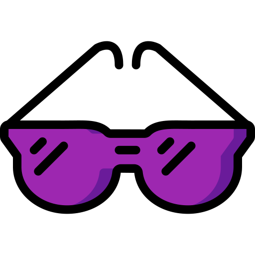

# Shades



[](https://travis-ci.org/bupa-digital/shades)

This is a CSS-in-JS library, designed to be very similar to Glamorous, but supports rendering styles to shadow dom (or anywhere else you want, really)

## Live REPL

If you want to try it out in a repl, [here's one I prepared earlier!](https://codesandbox.io/s/v3ypj97xz3)

## Github Page

Check out the Github page: https://bupa-digital.github.io/shades

## More Documentation

- **[Helpers](docs/helpers.md):** Built-in helper tools
  - [style](docs/helpers/style.md): For pseudo-selectors, attribute selectors and property pattern matching
  - [mq](docs/helpers/mq.md): For making media queries
- **[Generic Components & Composition](docs/composition.md)**

## Why

This library follows very closely with the syntax of certain prior-art, particularly: Glamorous.  Glamorous, in turn, follows a similar path to Aphrodite.  I looked into the pros and cons of both the Object-Literal style and the Template Literal style for building Shades, and decided to pursue the former, not because template literals are unfamiliar, but because I felt that the reasons I had for even considering a CSS-in-JS library were to get away from the CSS language.  So it made most sense to me to stay closer to JavaScript, in this case.  One day in the future this may change, but for now, if you want Template Literal syntax in addition to the Object Literal syntax, you will need to submit a PR :)

The Architecture we are moving towards at Bupa is something we like to call Valhalla.  It's a Monorepo Front-End architecture, which exposes modular web-components that serve as render targets for the underlying React components, where the actual UI logic comes from.  This is in order to allow us full flexibility and choice in the technology we want to use, while using smoke-and-mirrors to allow certain CMS solutions the illusion of full rendering control (Which they seem to demand for no good reason - and it had forced us to use Angular for a lot longer than we wanted)

This presented a problem when we wanted to use CSS-in-JS libraries such as Glamorous and Styled-Components.  We immediately discovered that there is a style boundary between elements in the shadow dom and the parent document.  Most CSS in JS libraries render the style tags to the `head` of the parent document, and have no ability to configure that behaviour to point to the Shadow DOM instead.  So, I decided it was time to have a go at making one of these myself.

Shout out to the wonderful creators of the Emotion library for their blog post on this subject, on which this library drew its initial inspiration.

## Peer Dependencies

Please ensure you install all the peer dependencies that are mentioned by yarn/npm after installing this package, if any.  This will not work without them.

## Usage

### Installation

`yarn add @bupa-digital/shades` (or `npm install --save @bupa-digital/shades`)

### Examples Galore

This assumes you're going to be using React.  There is an agnostic `css` function that you can also use, but it's seriously verbose and not really recommended for use on its own just yet.  Documentation for it will be coming later on.

The most important part of using Shades is the Shades provider - similar to Redux and other libraries, we use a Provider to supply a render target to all Shades elements that might be used inside the render tree.  This also means that you can have different Shades instances with different render targets for different shadow doms.

#### Without Shadow-Dom

If you aren't using the shadow-dom, then your shades provider could look as simple as:

```js
import shades from '@bupa-digital/shades/react';

const Button = shades.button({
  background: 'blue',
  color: 'white',
  cursor: 'pointer'
});

<shades.Provider to={document.querySelector('body')}>
  {/* the rest of your app goes here */}
  <Button>Click me!</Button>
</shades.Provider>
```

#### With Shadow-Dom

Here's an example of what a top level web component might look like:

`components/App.js`:

```js
import React from 'react';
import ReactDOM from 'react-dom';
import shades from '@bupa-digital/shades/react';

import CounterView from './CounterView';

customElements.define('counter-view', class extends HTMLElement {
  getAllAttributes() {
    const getAttr = (name) => this.getAttribute(name);

    const attributeNames = this.getAttributeNames();
    const attributeObj = attributeNames.reduce((result, attrKey) => ({
      ...result,
      [attrKey]: getAttr(attrKey)
    }), {});

    return attributeObj;
  }
  connectedCallback() {
    // Always use mode: open, never use mode: closed.
    const shadowRoot = this.attachShadow({ mode: 'open' });
    const attrs = this.getAllAttributes();
    // To support web compoment children in your react element
    const children = <slot />;

    const props = {
      ...attrs,
      children
    };

    ReactDOM.render(
      <shades.Provider to={shadowRoot}>
        <CounterView {...props} />
      </shades.Provider>
    )
  }
});
```

#### Debugging

To enable debug mode, which will make shades render styles that are visible to your browsers devtools, you can pass the `showDebug` property to the shades provider, e.g:

```js
<shades.Provider to={domNode} showDebug>
  ...
</shades.Provider>
```

#### Autoprefixer

To enable vendor prefixing with autoprefixer, you can pass a `prefixer` prop to the provider:

```js
<shades.Provider to={domNode} prefixer>
  ...
</shades.Provider>
```

By default, the configuration is:
- **browsers**: last 4 versions
- **grid**: true

To change these, just pass in your own configuration object to the `prefixer` prop like so:

```js
<shades.Provider to={domNode} prefixer={{browsers: 'latest', grid: false}}>
  ...
</shades.Provider>
```

#### Styling examples

Here are examples of most of the functionality built-in to Shades:

`components/CounterView.js`

```js
import React from 'react';
import shades from '@bupa-digital/shades/react';
import style from '@bupa-digital/shades/utils.style';
import mq from '@bupa-digital/shades/utils.mq';

const colours = {
  button: {
    dark: '#00335b',
    light: '#0079c8',
    border: {
      dark: '#000000'
    }
  },
  text: {
    dark: '#ffffff',
    light: '#000000'
  }
}
```

You can use just about any valid CSS with it (built in keyframe support and font-face coming soon)

```js
const SimpleBox = shades.div({
  ':hover': {
    textDecoration: 'underline',
    padding: '10px',
    boxShadow: '3px 3px 3px #000',
    color: '#000'
  },
  ':focus': {
    textDecoration: 'underline',
    padding: '10px',
    boxShadow: '3px 3px 3px #000',
    color: '#000'
  }
  '::before': {
    content: 'hello there'
  }
});
```

The above example has the same style rules duplicated for :hover and :focus (since it uses just strings), but shades comes with a helper for pseudo-selectors and attribute-selectors (and even prop selectors!) which also gives you the ability to combine selectors like you would in CSS, but with a few enhancements as well.  Here's what the above example looks like with the style helper:

```js
const SimpleBox = shades.div({
  [style.or(style.hover, style.focus)]: {
    textDecoration: 'underline',
    padding: '10px',
    boxShadow: '3px 3px 3px #000',
    color: '#000'
  },
  [style.element.before]: {
    content: 'hello there'
  }
});
```

Here we showcase a few magical features you can use in shades rules, specifically, you can use functions that take props as rules, and even do pattern matching on props!

```js
const Button = shades.button({
  border: '1px solid',
  // Yes, all props passed to this component can be used in both patterns and in functions
  color: ({ dark }) => dark && colours.text.dark,
  // Use the style helper to simplify pseudo-classes like `:hover`, `:active` and `:visited`
  // Alternatively, just specify a key like `':hover'` (see the SimpleBox example above)
  [style.hover]: {
    fontWeight: 'bold',
    textDecoration: 'underline',
    // You can even do media queries way down here
    '@media screen and (max-width: 400px)': {
      border: '1px dotted',
      [style.active]: {
        border: '2px dotted'
      }
    },
    // There's even a media query helper library built-in!
    // Here's an equivalent version using the mq helper:
    [mq().screen().to(400)]: {
      border: '1px dotted',
      [style.active]: {
        border: '2px dotted'
      }
    }
  }
});

const PseudoIcon = shades.i({
  // For pseudo-elements like `::before`, `::after`, `::first-letter`, etc
  // you can also use the style helper as an alternative to prefixing your
  // keys with '::'
  [style.element.before]: {
    fontSize: '15px',
    content: 'Hello there!'
  },
  // And as expected, you can nest style helper keys however you like
  [style.hover]: {
    [style.element.after]: {
      fontFamily: 'Material Icons',
      content: 'close'
    }
  }
  // Browser prefixes are passed through without any issue, so long as
  // they're defined as strings
  '-webkit-text-stroke': '4px navy'
})

// Pattern matching can be done for individual style rule values,
// like so:
const PatternButton = shades.button({
  padding: '10px',
  boxShadow: '3px 3px 3px #000',
  backgroundColor: '#fff',
  [style.prop.dark]: {
    backgroundColor: colors.button.dark
    color: colors.text.dark
  },
  // In the case of duplicate rules, the last instance will be the one that is used
  [style.prop.light]: {
    backgroundColor: colors.button.light,
    color: colours.text.light
  },
  [style.prop.mode]: (value) => {
    // Yep, even functions can be used in pattern matching. In this case,
    // `value` is the value of the `mode` property, if its defined.
    // If `mode` is not `super`, then this fn returns false, and
    // this property will be skipped.  You can return false, undefined or
    // null value from a function to skip the style rule.
    backgroundColor: value === 'super' && 'yellow'
    color: 'green'
  },
  // Now on to combinators - you can do the following combinators on
  // pseudos and props
  [style.and(style.hover, style.active)]: {
    [style.props.any(style.prop.dark, style.prop.light)]: {
      // You can even use arrays for rules that support multiple values
      boxShadow: ['2px 2px 3px 2px #000', '0px 0px 5px 2px dodgerblue']
    }
  },
  // Then there's attributes, which you can select for like so:
  [style.attr.src]: {
    textDecoration: 'underline'
  },
  // And of course, combinators on attributes too:
  [style.and(style.attr.src, style.attr.href.startsWith('http', 'https'))]: {
    content: 'icon-lock'
  }
});

export default () => (
  <SimpleBox>
    <PatternButton light>Hello there</PatternButton>
    <PatternButton dark>Goodbye there</PatternButton>
    <PatternButton mode="super"><PseudoIcon />Goodbye there</PatternButton>
    <Button>This is plain</Button>
  </SimpleBox>
);
```

#### HTML Attributes

Shades will happily pass along valid DOM properties to the styled element, such as `alt`, `title`, `href` for `a` tags, `src` for `img` and others, you get the picture.  Valid React props are also fully supported, such as `className`, `onClick`, etc.

Example:

```js
const Linky = shades.a({
  fontSize: '20px',
  fontWeight: 'bold'
});

export default () => (
  <Linky href="hello.html" title="This is a link" onClick={(event) => console.log('Wow, I was clicked!')}>
    Go to greeting
  </Linky>
);
```

You can also pass along `data` and `aria` attributes as you please!

```js
<Linky data-greeting="Hello there" aria-label="This is not a good label, just an example">
  Click me!
</Linky>
```

If you need to explicitly pass through an attribute to the underlying element that isn't necessarily valid, Shades provides an escape hatch.  To use it, simply prefix the attribute's name with `html-`.  For example, if you want to pass an attribute named `autoplay` to an `iframe` element that is defined with Shades:

```js
const ShadesFrame = shades.iframe({
  // styles go here
});

export default () => (
  <ShadesFrame html-autoplay="true" />
)
```

Your `autoplay` attribute will be rendered on the element like this:

```html
<iframe autoplay="true"></iframe>
```

## Attributions:

The Icon used by Shades was made by <a href="https://www.flaticon.com/authors/creaticca-creative-agency" title="Creaticca Creative Agency">Creaticca Creative Agency</a> from <a href="https://www.flaticon.com/" title="Flaticon">www.flaticon.com</a> and is licensed by <a href="http://creativecommons.org/licenses/by/3.0/" title="Creative Commons BY 3.0" target="_blank">CC 3.0 BY</a>
